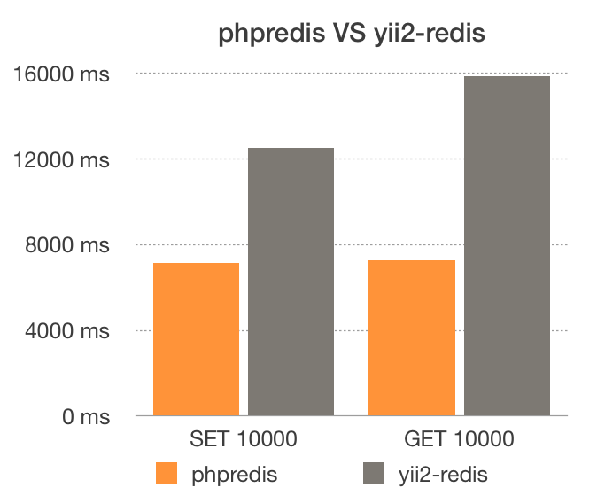

Redis Cache and Session for Yii2
======================
This extension provides the [redis](http://redis.io/) key-value store support for the [Yii framework 2.0](http://www.yiiframework.com).

It includes a `Cache` and `Session` storage handler in redis.


[](https://travis-ci.org/dcb9/yii2-phpredis)
[](https://codeclimate.com/github/dcb9/yii2-phpredis)
[](https://codeclimate.com/github/dcb9/yii2-phpredis/coverage)
[](https://codeclimate.com/github/dcb9/yii2-phpredis)
[](https://packagist.org/packages/dcb9/yii2-phpredis)
[](https://packagist.org/packages/dcb9/yii2-phpredis)
[](https://packagist.org/packages/dcb9/yii2-phpredis)

**Notice: THIS REPO DOES NOT SUPPORT ACTIVE RECORD.**

Requirements
------------

- PHP >= 5.4.0 
- Redis >= 2.6.12
- ext-redis >= 2.2.7
- Yii2 ~2.0.4

Installation
------------

The preferred way to install this extension is through [composer](http://getcomposer.org/download/).

Either run

```
php composer.phar require --prefer-dist dcb9/yii2-phpredis
```

or add

```json
"dcb9/yii2-phpredis": "~1.0"
```

to the require section of your composer.json.


Configuration
-------------

To use this extension, you have to configure the Connection class in your application configuration:

```php
return [
    //....
    'components' => [
        'redis' => [
            'class' => 'dcb9\redis\Connection',
            'hostname' => 'localhost',
            'port' => 6379,
            'database' => 0,
        ],
    ]
];
```

Run unit test
-------------

You can specific your redis config

```
$ cp tests/config.php tests/config-local.php
$ vim tests/config-local.php
```

and Run

```
$ ./vendor/bin/phpunit
PHPUnit 5.6.1 by Sebastian Bergmann and contributors.

............                           12 / 12 (100%)

Time: 600 ms, Memory: 10.00MB

OK (12 tests, 50 assertions)
```

Performance test
------------------

```
$ php tests/performance.php
```


